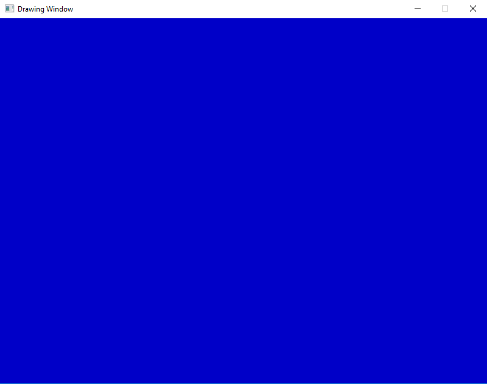
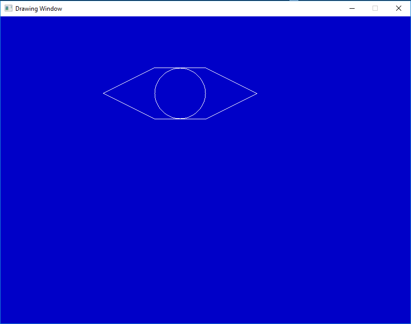
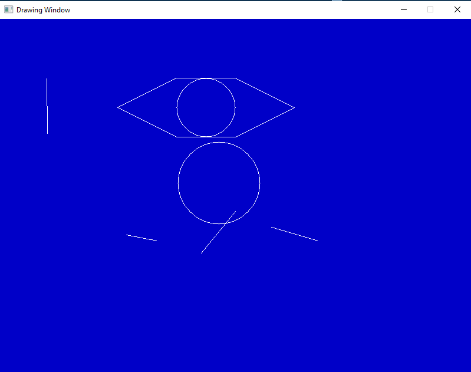

# Draw Cutting Trajectory - Work in Progress

**Requirement** 
The subject of this project is developing a program that controls laser cutting machine.
The program reads a file that contains the cutting trajectory as a sequence of segments and arcs and generates commands for bi-directional movements (x,y) of the cutting edge. The movement of the cutting edge will be simulated on the computer screen.

**Chosen approach** 
I've chosen C/C++ language to develop the application along with the SDL 2.0 library to implement the graphic simulation.

**How it works** 
The program will from a file point coordinates from which lines and circles will be drawn.  
A window with a blue blackground (reminiscent of blueprints) will be created that will be our canvas.

  

The program will proceed to drawing the lines and the circles point by point, simulating a laser cutting machine that follows a given trajectory.

  

Lastly, the user can add additional lines or circles using the mouse as a pointer and the mouse buttons to getermine the size of the objects.

  

